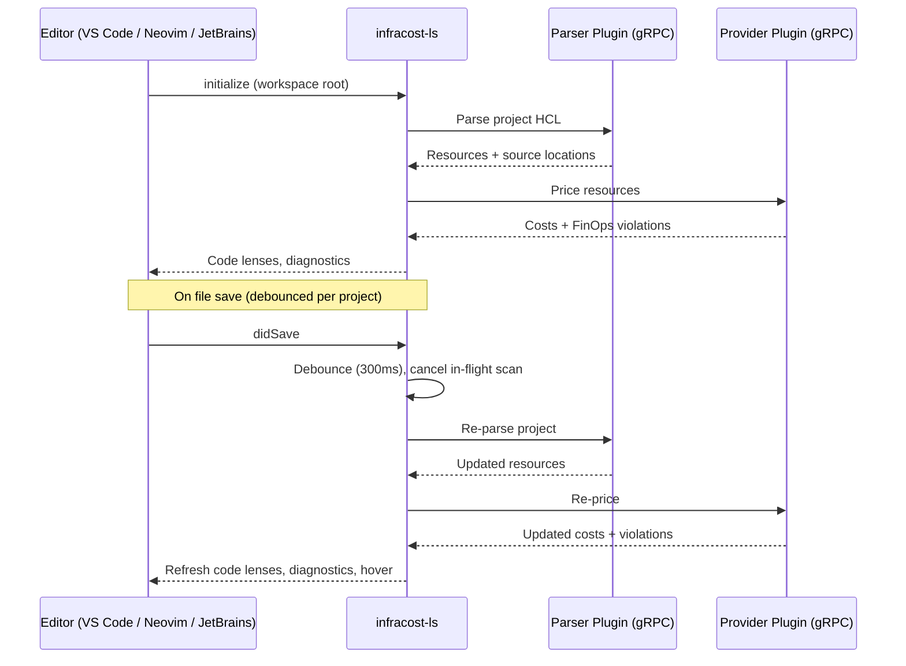

# Infracost LSP

> [!WARNING]
>
> This repository is in early alpha. Features may change and rough edges are expected.
> [Open a discussion thread](https://github.com/infracost/infracost/discussions) to report bugs or
> share feedback — it is genuinely appreciated.

A Language Server Protocol (LSP) server that shows cloud cost estimates inline while editing Terraform and CloudFormation files. It talks directly to the Infracost parser and provider gRPC plugins to analyze IaC and return costs.

## Features

- **Code Lenses** — `$X.XX/mo` shown above each resource block
- **Inlay Hints** — inline cost display for editors without code lens support
- **Hover** — markdown table with cost component breakdown
- **Diagnostics** — FinOps policy violations as warnings, parse errors as errors
- **Code Actions** — quick fixes for policy violations (attribute replacements, dismiss)
- **Dismiss / Ignore** — suppress violations per-resource or globally, persisted locally

## Prerequisites

- Go 1.25+
- Infracost parser and provider plugins (gRPC binaries)

## Editor Extensions

> [!NOTE]
> These extensions are in beta. Formal marketplace releases are coming soon.

- **VS Code**: [vscode-infracost v0.3.0-beta.2](https://github.com/infracost/vscode-infracost/releases/tag/v0.3.0-beta.2)
- **JetBrains**: [jetbrains-infracost v2.0.0-beta.1](https://github.com/infracost/jetbrains-infracost/releases/tag/v2.0.0-beta.1)

## Quickstart

> [!IMPORTANT]
> You need to have done a `login` with the [new cli](https://github.com/infracost/cli) - this will create your token file that the LSP currently piggy backs on. Without this, a lot of functionality won't work because it can't get your org, talk to the pricing server, talk to the dashboard, or anything.

1. Install one of the editor extensions above.
2. Open a directory containing `.tf`, `.yaml`, or `.json` IaC files. Cost lenses should appear above resource blocks.

## Configuration

The LSP server is configured via environment variables. Most are optional — the server discovers plugins from `PATH` by default.

| Variable | Description | Default |
|----------|-------------|---------|
| `INFRACOST_CLI_CURRENCY` | Currency for cost estimates | `USD` |
| `INFRACOST_LOG_LEVEL` | Log level (`debug` for verbose) | `warn` |
| `INFRACOST_CLI_PRICING_ENDPOINT` | Custom pricing API endpoint | `https://pricing.api.infracost.io` |
| `INFRACOST_CLI_DASHBOARD_ENDPOINT` | Custom dashboard API endpoint | `https://dashboard.api.infracost.io` |
| `INFRACOST_DEBUG_UI` | Port for debug UI (development only) | _(disabled)_ |

### Plugin overrides (for development/testing)

These override the plugin binaries the server launches. You only need them if the plugins aren't on your `PATH` or you want to test local builds.

| Variable | Description | Default |
|----------|-------------|---------|
| `INFRACOST_CLI_PARSER_PLUGIN` | Path to the parser plugin binary | `infracost-parser-plugin` (from PATH) |
| `INFRACOST_CLI_PROVIDER_PLUGIN_AWS` | Path to the AWS provider plugin | `infracost-provider-plugin-aws` (from PATH) |
| `INFRACOST_CLI_PROVIDER_PLUGIN_GOOGLE` | Path to the GCP provider plugin | `infracost-provider-plugin-google` (from PATH) |
| `INFRACOST_CLI_PROVIDER_PLUGIN_AZURERM` | Path to the Azure provider plugin | `infracost-provider-plugin-azurerm` (from PATH) |
| `INFRACOST_CLI_PARSER_PLUGIN_VERSION` | Parser plugin version override | _(latest)_ |
| `INFRACOST_CLI_PROVIDER_PLUGIN_AWS_VERSION` | AWS provider plugin version override | _(latest)_ |
| `INFRACOST_CLI_PROVIDER_PLUGIN_GOOGLE_VERSION` | GCP provider plugin version override | _(latest)_ |
| `INFRACOST_CLI_PROVIDER_PLUGIN_AZURE_VERSION` | Azure provider plugin version override | _(latest)_ |
| `INFRACOST_CLI_PLUGIN_MANIFEST_URL` | URL for the plugin manifest | `https://releases.infracost.io/plugins/manifest.json` |
| `INFRACOST_CLI_PLUGIN_CACHE_DIRECTORY` | Directory for cached plugin binaries | _(system default)_ |

### Workspace configuration

The server discovers projects from an `infracost.yml` file in the workspace root. This file defines project paths and settings used during scanning.

### Ignore file

Dismissed violations are stored in a local JSON file at `$XDG_CONFIG_HOME/infracost/ignores.json` (falls back to `~/.infracost/ignores.json`). Override the path with `INFRACOST_IGNORES_FILE`.

## Architecture



The server re-scans the affected project on file open or save. Rapid saves are debounced per project — only one scan runs at a time, and a new save cancels any in-flight scan. Results are cached per project and used to serve code lens and hover requests.

## Vim / Neovim

The LSP server communicates over stdio and follows the LSP 3.16 spec, so it works with any editor that has LSP support.

For Neovim, add the following to your config (or adapt it for your plugin manager):

```lua
vim.api.nvim_create_autocmd("FileType", {
  pattern = "terraform",
  callback = function()
    local root = vim.fs.dirname(vim.fs.find("infracost.yml", { upward = true })[1])
      or vim.fn.fnamemodify(vim.api.nvim_buf_get_name(0), ":p:h")
    vim.lsp.start({
      name = "infracost",
      cmd = { "infracost-ls" },
      root_dir = root,
      capabilities = vim.lsp.protocol.make_client_capabilities(),
    })
  end,
})
```

This starts the LSP client automatically when opening `.tf` files. Make sure `infracost-ls` is on your `PATH` (see Development below).

## Development

### Building

```bash
make build      # build to bin/infracost-ls
make install    # build and copy to ~/go/bin/
```

### Testing with Neovim

A minimal Neovim plugin is included for quick iteration:

```bash
make nvim-run DIR=~/my-terraform-project
```

### Testing with VS Code

1. Install the [VS Code extension](https://github.com/infracost/vscode-infracost/releases/tag/v0.3.0-beta.2).
2. In VS Code settings, set `infracost.serverPath` to your local build (e.g. `~/go/bin/infracost-ls`).
3. Reload the window. The extension will use your local LSP binary.

### Testing with JetBrains

1. Install the [JetBrains plugin](https://github.com/infracost/jetbrains-infracost/releases/tag/v2.0.0-beta.1).
2. Configure the plugin to point to your local `infracost-ls` binary.
3. Restart the IDE.
