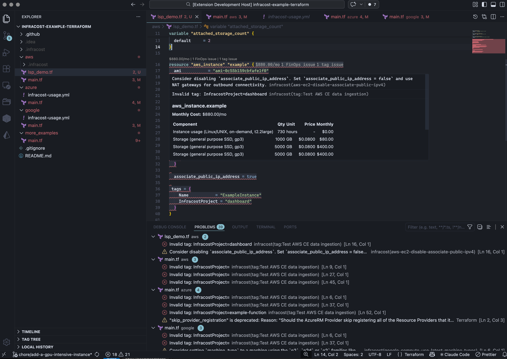
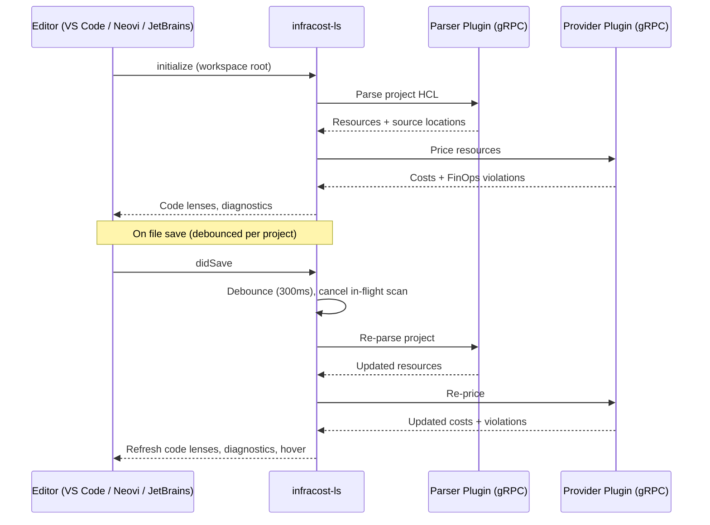

# Infracost LSP

> [!IMPORTANT]
> Early Stage PoC - thing may not work they way you expect or we want them too!

A Language Server Protocol (LSP) server that shows cloud cost estimates inline while editing Terraform and CloudFormation files. It talks directly to the Infracost parser and provider gRPC plugins to analyze IaC and return costs.

## Features

- **Code Lenses** — `$X.XX/mo` shown above each resource block
- **Inlay Hints** — inline cost display for editors without code lens support
- **Hover** — markdown table with cost component breakdown
- **Diagnostics** — FinOps policy violations as warnings, parse errors as errors
- **Code Actions** — quick fixes for policy violations (attribute replacements, dismiss)
- **Dismiss / Ignore** — suppress violations per-resource or globally, persisted locally

## Prerequisites

- Go 1.25+
- Node.js 18+ (for the VS Code extension)
- Infracost parser and provider plugins (gRPC binaries)



## Quickstart

> [!IMPORTANT]
> You need to have done a `login` with the [new cli](https://github.com/infracost/cli) - this will create your token file that the lsp currently piggy backs on. Without this, a lot of functionality wont work because it can't get your org, talk to the pricing server, talk to dashboard or anything.

When you've done the `login` dance, you're ready to use the make target of your choice...

Each editor has a single `make` target that builds the LSP server, installs it, and launches the editor with the plugin loaded:

```bash
# VS Code
make vscode-run

# Neovim (DIR= to open a specific directory)
make nvim-run DIR=~/my-terraform-project

# JetBrains (IntelliJ / GoLand with Ultimate)
make jetbrains-run
```

> [!WARNING]
> Use of the native LSP integration requires a JetBrains license, community editions won't work. We may need to switch to a 3rd party to support community but not convinced of the value in that yet.

Open a `.tf` file and cost estimates should appear above resource blocks.

## Configuration

The LSP server is configured via environment variables. Most are optional — the server discovers plugins from `PATH` by default.

| Variable | Description | Default |
|----------|-------------|---------|
| `INFRACOST_CLI_CURRENCY` | Currency for cost estimates | `USD` |
| `INFRACOST_LOG_LEVEL` | Log level (`debug` for verbose) | `warn` |
| `INFRACOST_CLI_PRICING_ENDPOINT` | Custom pricing API endpoint | `https://pricing.api.infracost.io` |
| `INFRACOST_CLI_DASHBOARD_ENDPOINT` | Custom dashboard API endpoint | `https://dashboard.api.infracost.io` |
| `INFRACOST_DEBUG_UI` | Port for debug UI (development only) | _(disabled)_ |

### Plugin overrides (for development/testing)

These override the plugin binaries the server launches. You only need them if the plugins aren't on your `PATH` or you want to test local builds.

| Variable | Description | Default |
|----------|-------------|---------|
| `INFRACOST_CLI_PARSER_PLUGIN` | Path to the parser plugin binary | `infracost-parser-plugin` (from PATH) |
| `INFRACOST_CLI_PROVIDER_PLUGIN_AWS` | Path to the AWS provider plugin | `infracost-provider-plugin-aws` (from PATH) |
| `INFRACOST_CLI_PROVIDER_PLUGIN_GOOGLE` | Path to the GCP provider plugin | `infracost-provider-plugin-google` (from PATH) |
| `INFRACOST_CLI_PROVIDER_PLUGIN_AZURERM` | Path to the Azure provider plugin | `infracost-provider-plugin-azurerm` (from PATH) |
| `INFRACOST_CLI_PARSER_PLUGIN_VERSION` | Parser plugin version override | _(latest)_ |
| `INFRACOST_CLI_PROVIDER_PLUGIN_AWS_VERSION` | AWS provider plugin version override | _(latest)_ |
| `INFRACOST_CLI_PROVIDER_PLUGIN_GOOGLE_VERSION` | GCP provider plugin version override | _(latest)_ |
| `INFRACOST_CLI_PROVIDER_PLUGIN_AZURE_VERSION` | Azure provider plugin version override | _(latest)_ |
| `INFRACOST_CLI_PLUGIN_MANIFEST_URL` | URL for the plugin manifest | `https://releases.infracost.io/plugins/manifest.json` |
| `INFRACOST_CLI_PLUGIN_CACHE_DIRECTORY` | Directory for cached plugin binaries | _(system default)_ |

### Workspace configuration

The server discovers projects from an `infracost.yml` file in the workspace root. This file defines project paths and settings used during scanning.

### Ignore file

Dismissed violations are stored in a local JSON file at `$XDG_CONFIG_HOME/infracost/ignores.json` (falls back to `~/.infracost/ignores.json`). Override the path with `INFRACOST_IGNORES_FILE`.

## Architecture



The server re-scans the affected project on file open or save. Rapid saves are debounced per project — only one scan runs at a time, and a new save cancels any in-flight scan. Results are cached per project and used to serve code lens and hover requests.

## VS Code Setup

1. Build the LSP binary and ensure it's in your PATH (or note the absolute path):

   ```bash
   make build
   export PATH="$PWD/bin:$PATH"
   ```

2. Install the VS Code extension:

   ```bash
   cd plugins/vscode
   npm install
   npm run compile
   ```

   Then in VS Code: **Extensions** → **...** → **Install from VSIX** or use the `--extensionDevelopmentPath` flag:

   ```bash
   code --extensionDevelopmentPath=$PWD/plugins/vscode
   ```

3. Open a directory containing `.tf`, `.yaml`, or `.json` IaC files. Cost lenses should appear above resource blocks.

### VS Code Extension Settings

| Setting | Description | Default |
|---------|-------------|---------|
| `infracost.serverPath` | Path to the `infracost-ls` binary | `infracost-ls` |
| `infracost.runParamsCacheTTLSeconds` | How long (seconds) to cache org policies between API calls. `0` to disable. | `300` |

## Neovim Setup

A minimal Neovim plugin is included at `plugins/neovim/`. It automatically starts the LSP client for Terraform files.

1. Build and install the LSP binary:

   ```bash
   make install
   ```

2. Add the plugin to your runtime path, or use `make nvim-debug` to launch Neovim with it loaded:

   ```bash
   make nvim-debug
   ```

3. Open a `.tf` file. `:LspInfo` should show the infracost server attached.

## Using with Other Editors

The LSP server communicates over stdio and follows the LSP 3.16 spec. Any editor with LSP support can use it.
